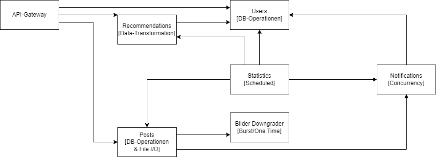

# Error Handling in a Microservice Architecture

TBD

_This project is part of a Masterthesis in Computer Science🎓_

## Overview Architecture 🏗️

## API Reference 👀

TBD

## Tech Stack 📚

TBD

## Energy efficiency practices 🔌⚡

TBD

## Analysis of the Demo-Application 🧪

TBD

## Run Locally 🏃

Requirements: 
 - https://kompose.io/installation/
 - Docker and or Kubernetes
 - https://github.com/prometheus-community/helm-charts/tree/main/charts/prometheus for Kubernetes Metrics

TBD

## Deployment 🚀

TBD

## Known Issues 🦺

TBD

## Author ✍️

[@Tobias Peslalz](https://github.com/Tobias-Pe)

